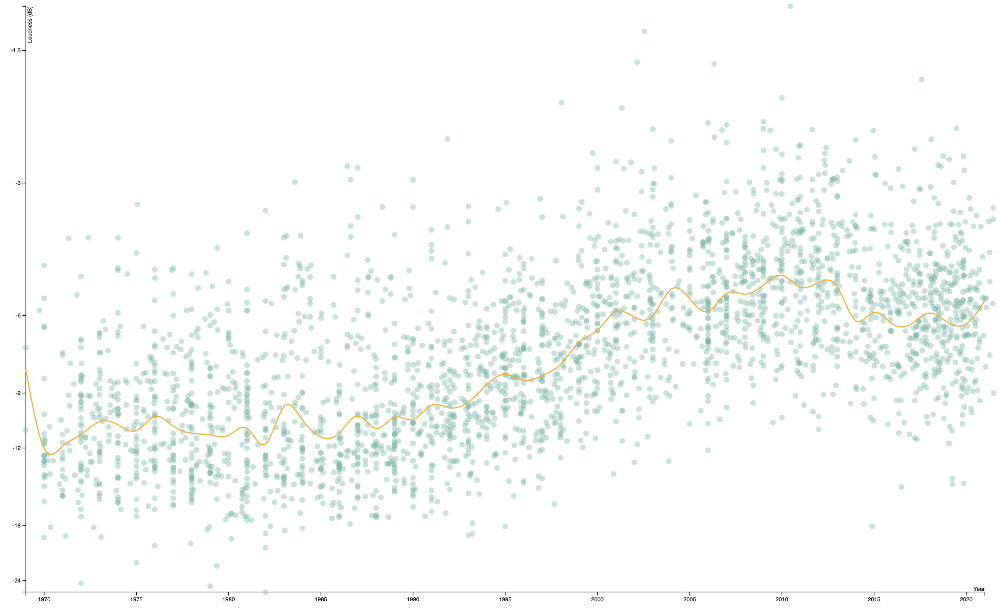

loudness wars
===

The [loudness wars](https://ryanrishi.com/projects/loudness-wars) refers to the increasing loudness of recorded music. The overall loudness of popular music is increasing because producers are adding increasing amounts dynamic compression.



# Usage
## `virtualenv`
```sh
$ virtualenv venv
$ source venv/bin/activate
```

## `pip`
```sh
$ pip install -r requirements.txt
```

## config
Register for a Spotify developer account [here](https://developer.spotify.com/dashboard). Get the `client_id` and `client_secret` and put them in a file named `config` (see `example.config` for an example config).

## Run it
Seed the Billboard database
```sh
$ python billboard.py
````

Scrape track information from Spotify
```sh
$ python loudness_wars.py
```

